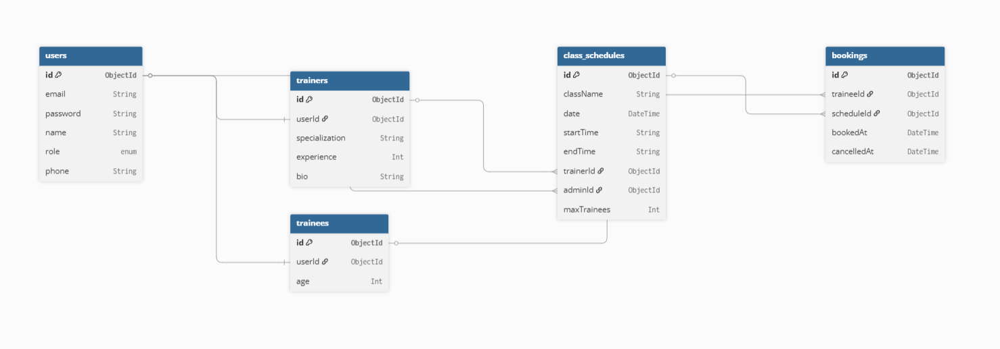

# 🏋️ Gym Class Scheduling and Membership Management System

A comprehensive **gym management backend system** built with **TypeScript, Express.js, Prisma, and MongoDB**.  
The system supports **three user roles** (Admin, Trainer, Trainee) with **role-based access control**, **class scheduling**, and **booking functionality**.

---

## 🚀 Live Demo

- **Live API**: https://gym-class-management-amlan-ahmeds-projects.vercel.app/

---

## 📌 Project Overview

This system efficiently manages gym operations with the following features:

- **3 User Roles**: Admin, Trainer, Trainee (each with specific permissions)
- **Class Scheduling**: Admins can create schedules  
  - Max **5 schedules per day**
  - Each class duration is **2 hours**
- **Booking System**:  
  - Trainees can book classes  
  - Max **10 trainees per schedule**
- **Profile Management**: Users manage their own profiles
- **JWT Authentication**: Secure token-based authentication
- **Business Rules Enforcement**: Prevents overbooking and scheduling conflicts

---

## 🧩 System Relation Diagram



---

## 🗄️ Database Models (Prisma Schema)

```prisma
// User Model - Base user for all roles
model User {
  id                String          @id @default(auto()) @map("_id") @db.ObjectId
  email             String          @unique
  password          String
  name              String
  role              UserRole        // ADMIN | TRAINER | TRAINEE
  phone             String?
  traineeProfile    Trainee?
  trainerProfile    Trainer?
  createdSchedules  ClassSchedule[] @relation("AdminSchedules")
}

// Trainer Profile (extends User)
model Trainer {
  userId            String          @unique @db.ObjectId
  specialization    String?
  experience        Int?
  bio               String?
  assignedSchedules ClassSchedule[]
}

// Trainee Profile (extends User)
model Trainee {
  userId            String          @unique @db.ObjectId
  age               Int?
  bookings          Booking[]
}

// Class Schedule (created by Admin)
model ClassSchedule {
  className         String
  date              DateTime
  startTime         String
  endTime           String
  trainerId         String          @db.ObjectId
  adminId           String          @db.ObjectId
  maxTrainees       Int             @default(10)
  bookings          Booking[]
}

// Booking (Trainee books ClassSchedule)
model Booking {
  traineeId         String          @db.ObjectId
  scheduleId        String          @db.ObjectId
  bookedAt          DateTime        @default(now())
  cancelledAt       DateTime?
  @@unique([traineeId, scheduleId])
}
## 🛠️ Technology Stack

- **Language:** TypeScript  
- **Runtime:** Node.js  
- **Framework:** Express.js  
- **Database:** MongoDB (Atlas)  
- **ORM:** Prisma  
- **Authentication:** JWT (JSON Web Tokens)  
- **Password Hashing:** bcryptjs  
- **Validation:** express-validator  
- **Deployment:** Vercel  
- **Architecture:** Modular Pattern  

---

## 🔐 Admin Credentials (Testing)

Use the following credentials to test admin-level features:

Email: `admin@gym.com`  
Password: `admin123`

---

## 📡 API Endpoints

### 🔑 Authentication Routes (Public)

- `POST /api/auth/login` → Login (all roles)  
- `POST /api/auth/register` → Trainee self-registration  

---

### 👤 User Management Routes (ADMIN only)

- `POST /api/users/create` → Create Trainer or Trainee  
- `GET /api/users` → Get all users  

---

### 🧍 Trainee Routes (TRAINEE only)

- `GET /api/trainees/profile` → Get own profile  
- `PUT /api/trainees/profile` → Update own profile  

---

### 🧑‍🏫 Trainer Routes (TRAINER only)

- `GET /api/trainers/profile` → Get own profile  
- `PUT /api/trainers/profile` → Update own profile  
- `GET /api/trainers/schedules` → View assigned schedules  

---

### 📅 Schedule Routes (ADMIN only)

- `POST /api/schedules/create` → Create class schedule  
- `GET /api/schedules` → Get all schedules  
- `GET /api/schedules/:id` → Get schedule by ID  

---

### 📝 Booking Routes (TRAINEE only)

- `POST /api/bookings/book` → Book a class  
- `GET /api/bookings/my-bookings` → View own bookings  
- `DELETE /api/bookings/:id` → Cancel booking  

---

## 🔄 API Request & Response Example

### Login

**Request**
```http
POST /api/auth/login
Content-Type: application/json

{
  "email": "admin@gym.com",
  "password": "admin123"
}
{
  "success": true,
  "statusCode": 200,
  "message": "Login successful",
  "data": {
    "user": {
      "id": "65f8a9b1c2d3e4f5a6b7c8d9",
      "email": "admin@gym.com",
      "name": "Admin User",
      "role": "ADMIN"
    },
    "token": "eyJhbGciOiJIUzI1NiIsInR5cCI6IkpXVCJ9..."
  }
}

## ▶️ Running Locally

Prerequisites
Node.js (v18 or higher)
MongoDB Atlas or local MongoDB
Git

Installation
git clone https://github.com/AMLAN1000/gym-class-management.git

cd gym-class-management
npm install

## Environment Setup
Create a .env file in the root directory and add:
NODE_ENV=development
PORT=5000
DATABASE_URL=your_mongodb_connection_string
JWT_SECRET=your-super-secret-jwt-key
JWT_EXPIRES_IN=7d
BCRYPT_SALT_ROUNDS=12

## Database Setup
npx prisma generate
npx prisma db push
npm run prisma:seed

Start Server
npm run dev

Server will run at: http://localhost:5000

## Business Rules Implemented

Maximum 5 class schedules per day
Maximum 10 trainees per class
Fixed 2-hour class duration
Prevents double booking
Role-based access control using JWT
Secure password storage using bcrypt

## Project Structure

gym-class-management/
├── prisma/
├── src/
│ ├── config/
│ ├── middlewares/
│ ├── modules/
│ ├── utils/
│ ├── types/
│ ├── app.ts
│ └── server.ts
├── .env
├── package.json
├── tsconfig.json
├── vercel.json
└── README.md